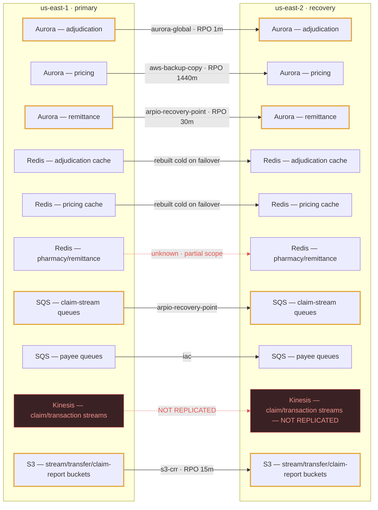
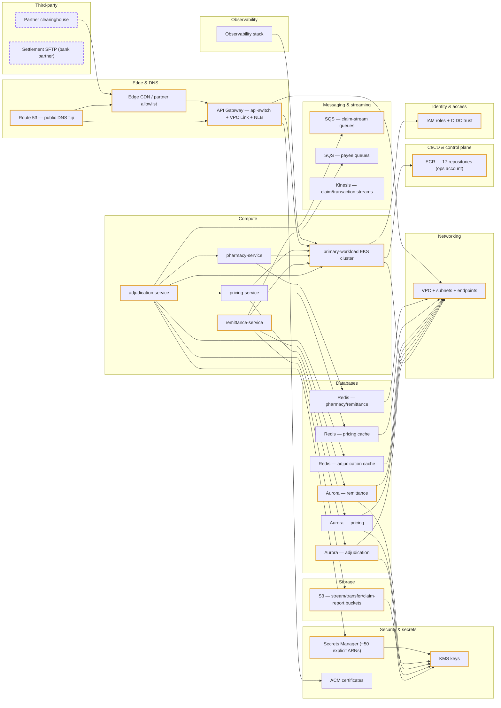

# Generated diagrams — the example workspace

Every diagram below is generated from the inventory of the bundled
`example-acme` workspace. Nothing here was drawn by hand: change a component
and the picture changes with it.

These pages render on GitHub. In the app the same source renders live on the
**Diagrams** page, which additionally offers the icon canvas (official AWS /
Kubernetes / CNCF icons, draggable, with saved layouts) and SVG / PNG / draw.io
downloads — those need a browser, so they are not reproduced here.

## Data replication map

Source: `data-replication.mmd` — the exact bytes returned by `GET /api/w/example-acme/diagrams/data-replication/mmd`.

This is the one worth reading first. It says, per store, how the bytes reach
the recovery region and at what RPO — and it draws the two stores that have no
answer (a Kinesis stream with no cross-region replication, and a cache whose
scope is unknown) in red, because a blank field is the finding.

## Restore layer cake

Source: `restore-layers.mmd` — the exact bytes returned by `GET /api/w/example-acme/diagrams/restore-layers/mmd`.

What has to be green before the next layer can start: L0 guardrails through L7
live cutover. The app orders runbook steps and the deployment-order waves
against this same ladder.

```mermaid
flowchart TB
  subgraph L0["L0 · Guardrails & backups"]
    direction LR
    c21["IAM roles + OIDC trust"]
    c22["KMS keys"]
    c23["ACM certificates"]
  end
  subgraph L1["L1 · Recovery launch"]
    direction LR
    c19["ECR — 17 repositories (ops account)"]
  end
  subgraph L2["L2 · Platform"]
    direction LR
    c0["primary-workload EKS cluster"]
    c20["VPC + subnets + endpoints"]
    c26["Observability stack"]
  end
  subgraph L3["L3 · Data & secrets"]
    direction LR
    c5["Aurora — adjudication"]
    c6["Aurora — pricing"]
    c7["Aurora — remittance"]
    c8["Redis — adjudication cache"]
    c9["Redis — pricing cache"]
    c10["Redis — pharmacy/remittance"]
    c11["SQS — claim-stream queues"]
    c12["SQS — payee queues"]
    c13["Kinesis — claim/transaction streams"]
    c14["S3 — stream/transfer/claim-report buckets"]
    c15["Secrets Manager (~50 explicit ARNs)"]
  end
  subgraph L4["L4 · Applications"]
    direction LR
    c1["adjudication-service"]
    c2["remittance-service"]
    c3["pharmacy-service"]
    c4["pricing-service"]
  end
  subgraph L5["L5 · Edge reachability"]
    direction LR
    c16["API Gateway — api-switch + VPC Link + NLB"]
    c18["Edge CDN / partner allowlist"]
    c24["Partner clearinghouse"]
    c25["Settlement SFTP (bank partner)"]
  end
  subgraph L6["L6 · Functional success bar"]
    direction LR
    g6["(no components mapped)"]
  end
  subgraph L7["L7 · Live cutover"]
    direction LR
    c17["Route 53 — public DNS flip"]
  end
  L0 --> L1
  L1 --> L2
  L2 --> L3
  L3 --> L4
  L4 --> L5
  L5 --> L6
  L6 --> L7
  classDef tier0 stroke:#e2a336,stroke-width:2.5px
  classDef thirdparty stroke-dasharray:6 4,stroke:#9d7bf5
  classDef notrep fill:#3a2224,stroke:#e2564f,color:#f2938e
  classDef ghost fill:transparent,stroke:#2a3242,stroke-dasharray:3 3,color:#8a94a6
  classDef extaws stroke:#4f8ff7,stroke-dasharray:4 3
  classDef extthird stroke:#9d7bf5,stroke-dasharray:6 4
  classDef extsaas stroke:#3fb27f,stroke-dasharray:4 3
  classDef extonprem stroke:#e2a336,stroke-dasharray:4 3
  classDef extinternal stroke:#8a94a6,stroke-dasharray:4 3
  class c21,c22,c19,c0,c20,c5,c7,c11,c14,c15,c1,c2,c16,c18,c24,c25,c17 tier0
  class c24,c25 thirdparty
  class c13,c18,c24,c17 notrep
  class g6 ghost
```

## Architecture overview

Source: `architecture.mmd` — the exact bytes returned by `GET /api/w/example-acme/diagrams/architecture/mmd`.

Components grouped by category with their declared dependencies. Tier-0
components are outlined; third parties are dashed, because they are the things
you cannot redeploy.

## Same diagram, other formats

- `architecture.drawio` — `GET …/diagrams/architecture/drawio?style=aws`. Open it
  in [diagrams.net](https://app.diagrams.net) or the draw.io desktop app; it uses
  the `mxgraph.aws4` shape library, so it renders with official AWS icons.
  Drop `?style=aws` for plain boxes.
- `architecture.mmd` — the raw Mermaid source. Add `?flavor=lucid` to the same
  endpoint for a Lucidchart-safe variant (Lucid rejects `classDef`, `class`,
  `style`, `linkStyle`, `%%{init}%%` and in-subgraph `direction`; the lucid
  flavor strips them and says in a comment how many lines it removed).
